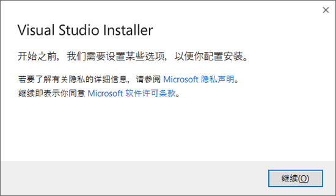

# 如何使用vs2019来运行和调试32位汇编代码

##一、Vs基本安装和设置（如果电脑上已经安装过vs并且运行过c/c++代码可以跳过这一步）

1. 安装vs。vs全称visual studio，是微软开发的一款主要用于c/c++的集成开发环境（IDE），目前最新版本为vs2022版本，推荐下载2019及以前的版本（软件稳定，网上资料多）用来自用。
[Visual Studio 2019 版本 16.11 发行说明 | Microsoft Docs](https://learn.microsoft.com/zh-cn/visualstudio/releases/2019/release-notes)
2. 下载 VS2019 会得到一个名为 "vs2019_community" 的可执行文件，双击打开它，会弹出如下界面：

3. 点击“继续”，会进入如下界面：

4. 待两个进度条全部达到 100% 后，会自行弹出如下界面：

5. VS 2019 除了支持 C/C++ 开发，还支持 C#、F#、Visual Basic 等开发语言，我们没有必要安装所有的组件，只需要安装 “使用C++ 的桌面开发” 即可。此外，可以选择 VS 2019 的安装路径，最终点击 "安装" 按钮，进入如图所示的界面

6. 耐心等待两个进度条全部为 100%，可能会弹出下面的窗口，提示我们“安装成功，需要重启计算机”，重启即可。

 

二、	vs下进行汇编的设置
1. 创建新项目，选择c++空项目
2. 设置依赖项：项目生成依赖项——>生成自定义——>选择masm

3. 新建源文件：源文件——>添加——>新建项——>选择c++文件（.cpp）——>后缀改为(.asm)

4. 设置附加库路径（！！！）
****如果这一步始终没办法正常完成，可以直接跳过这一步来进行开发，只是代码中不能包含”include io32.inc”的语句，也不能使用io32里面的函数（主要是disp函数），其他功能则不受影响

* 项目——>属性——>链接器——>常规——>附加库目录(lib文件)
* 项目——>属性——>连接器——>输入——>附加依赖项——>添加你用到的lib文件（没有用到的lib文件不要加！！！）
* 项目——>属性——>Microsoft Micro Assembler——>General——>include path——>添加 (.inc) 文件的地址
(如果没有Microsoft Micro Assembler)这一项的话，先检查步骤2是否成功设置依赖项，再把asm文件删除重新添加）
5. 写代码
6. 可以直接运行，也可以单步进行调试（f10、f11），也可以加断点调试
7. 添加寄存器查看界面：
* 进入调试阶段（单步进入或者断点调试形式）
* 依次选择调试——窗口——寄存器（反汇编也可以加）

* 在寄存器界面右键，选择CPU、CPU段以及标志
 
三、	AsmDude插件安装（代码高亮、报错工具）
1.	拓展——管理拓展——搜索AsmDude——下载——重启完成安装
2.	调试——选项——选择AsmDude——配置颜色

3.	Undefined Labels / Undefined includes取消勾选（消除下划线）

